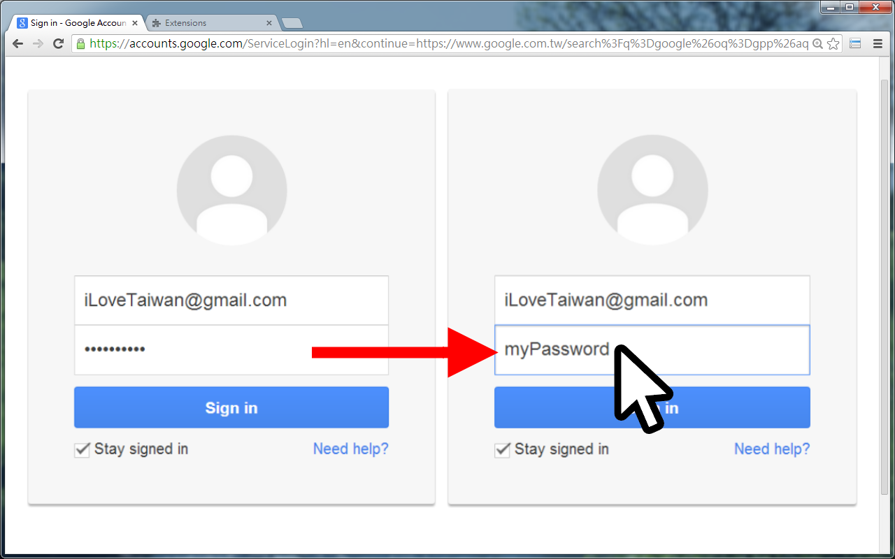

<a href="#"></a>
[](https://opensource.org/licenses/MIT)
[](https://github.com/jcs-chromews/password-toggle/releases/latest)
[](https://chromewebstore.google.com/detail/browser-statistic/ngeihapmaidpbmmbdllecafpnlhnbcmd)

# password-toggle
> Show/Hide passwords on the page

<p align="center">

</p>

## 🔧 Development

To build the project:

```sh
$ npm run build
```

To run the project:

```sh
$ vite
```

## ⚜️ License

`password-toggle` is distributed under the terms of the MIT license.

See [LICENSE](./LICENSE) for details.
